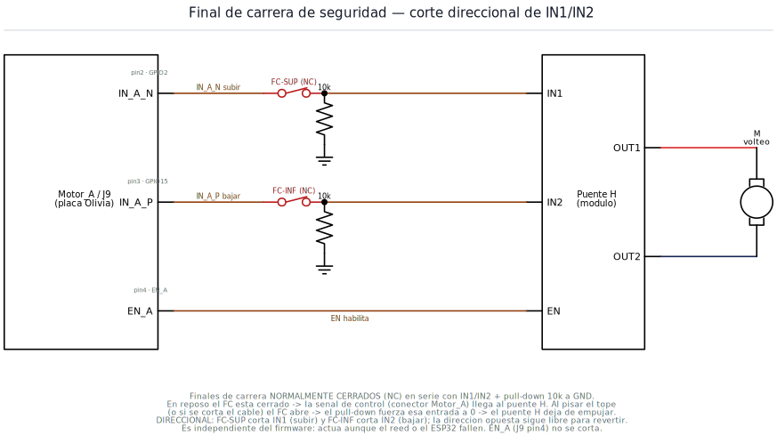

# Final de carrera de seguridad — corte de IN1/IN2 del puente H

Enclavamiento **por hardware** que detiene el motor de volteo ante un
sobre-recorrido, aunque el firmware o los reed switches fallen. Se suma a los
reed switches existentes (no los reemplaza).

## Esquemas




## Cómo funciona

Hoy el ESP32 maneja el puente H con tres señales (ver `src/embedded/libs/credentials.lua`):

| Señal | GPIO | Función |
|-------|------|---------|
| `IN1` (`GPIOVOLTEO_UP`)   | 2  | subir |
| `IN2` (`GPIOVOLTEO_DOWN`) | 15 | bajar |
| `EN`  (`GPIOVOLTEO_EN`)   | 13 | habilita salida |

Los reed switches (`GPIOREEDS_UP`=35, `GPIOREEDS_DOWN`=34, pull-up interno) los
**lee** el firmware para frenar en el punto normal: son *sensado*, no cortan
nada por hardware.

El final de carrera de seguridad agrega una segunda capa **independiente del
software**: dos microswitches **normalmente cerrados (NC)** intercalados en
serie en las líneas lógicas `IN1` e `IN2`, con un **pull-down de 10 kΩ a GND**
del lado del puente H.

- **En reposo** el FC está cerrado → la señal del ESP32 llega al puente H. Todo
  funciona como hasta ahora.
- **Al pisar el tope** (o si se corta el cable del FC) el FC abre → el pull-down
  fuerza esa entrada a `0` → el puente H deja de empujar en esa dirección.

Es **fail-safe**: contacto NC + pull-down ⇒ un cable cortado o un FC suelto
también detiene el motor (estado seguro = parado).

### Comportamiento direccional

- **FC-SUP** (tope superior) corta **IN1 (subir)** y deja **IN2 (bajar)** libre.
- **FC-INF** (tope inferior) corta **IN2 (bajar)** y deja **IN1 (subir)** libre.

Así, al llegar al tope el motor no puede seguir en esa dirección pero **sí puede
revertir** para salir del fin de carrera. No hace falta intervención manual ni
diodos: al ser `IN1` e `IN2` líneas lógicas independientes, cada FC actúa solo
sobre su dirección.

`EN` (GPIO13) **no** se corta: el corte va solo en las entradas de dirección,
tal como se pidió.

## Componentes a agregar

| Ref | Componente | Cant | Notas |
|-----|------------|------|-------|
| FC-SUP, FC-INF | Microswitch / final de carrera con palanca, contacto **NC** | 2 | Usar el terminal **NC** (común + normalmente cerrado) |
| R_PD1, R_PD2 | Resistencia 10 kΩ | 2 | Pull-down de `IN1`/`IN2` a GND, del lado del puente H |

> Montaje mecánico: ubicar cada FC **apenas más allá** del reed correspondiente,
> de modo que solo se accione si el mecanismo pasa el punto de frenado normal.

## Regenerar los esquemas

Se dibujan con [`schemkit`](../../../../schemkit) (repo vecino) sobre schemdraw:

```bash
/home/pablo/repos/schemkit/.venv/bin/python safety_endstop.py
# genera schematics/*.svg
```
